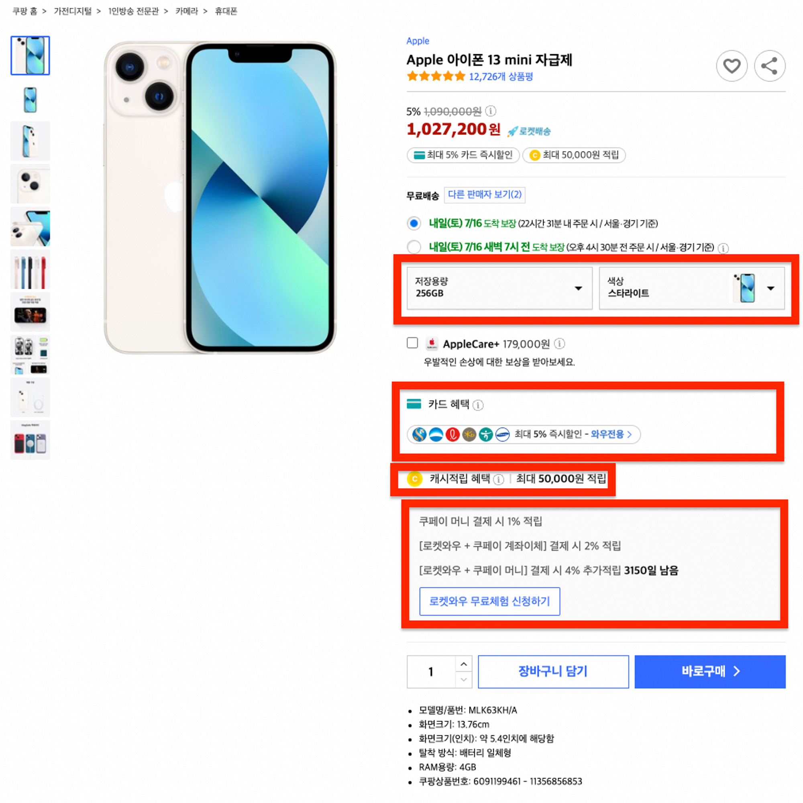
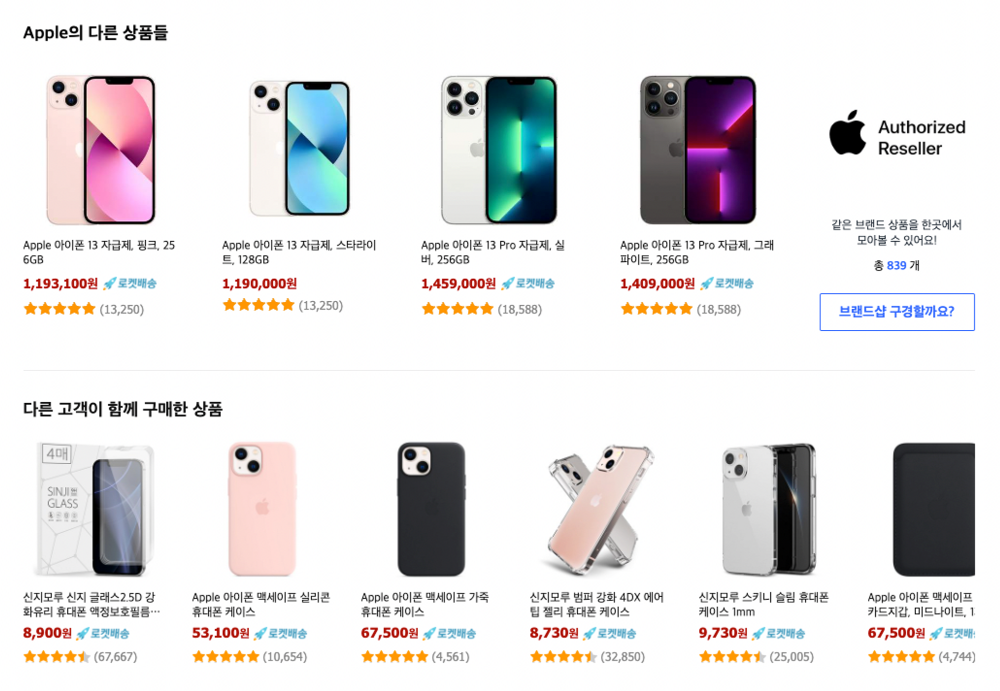
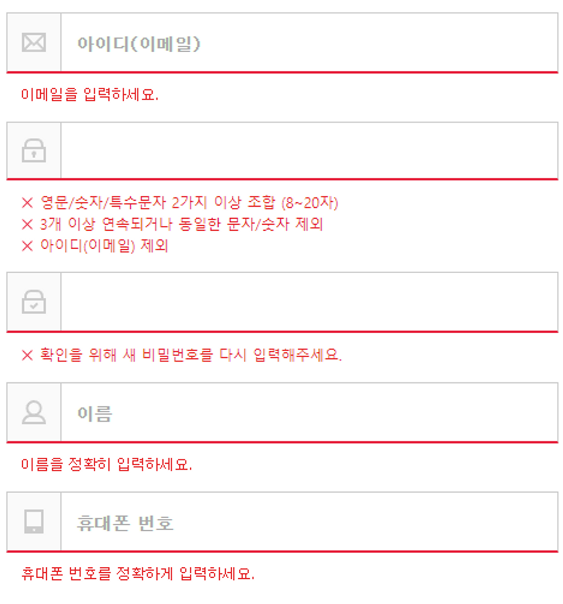
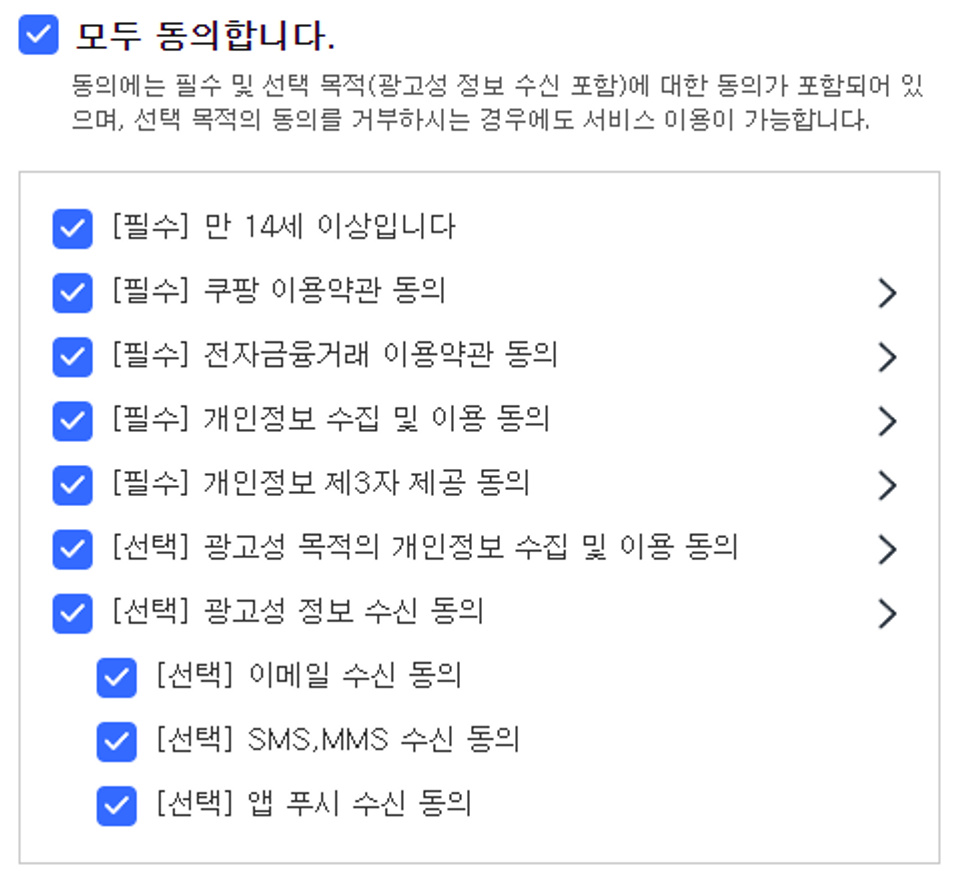

# NUMBLE - 가장 실무에 가까운 쿠팡 클론코딩 2회차

### 배포

[로그인 페이지](https://stalwart-arithmetic-64bd26.netlify.app/auth/login)

[회원가입 페이지](https://stalwart-arithmetic-64bd26.netlify.app/auth/signup)

[Storybook Chromatic 배포 URL](https://634f61794a50407deecee4b4-zcznhsvkzt.chromatic.com/?path=/story/button--agreement-sign-up)

<details>
  <summary style='font-size:20px'>과제보기</summary>

  <div markdown="1">

  <br/>

## 미션 소개

- 쿠팡 서비스의 [로그인 페이지](https://login.coupang.com/login/login.pang)와 [회원가입 페이지](https://login.coupang.com/login/memberJoinFrm.pang)에서 사용되는 컴포넌트들을 만들어볼 것입니다.

- 총 네 개의 컴포넌트를 설계하며, 실무에서처럼 다양한 유즈케이스에 탄력적으로 대응할 수 있는 구조에 대해서 고민해봅니다.

- 설계한 컴포넌트를 구현하고, 서로의 코드를 통해 더 나은 방법에 대해서 생각해봅니다.

- 만든 컴포넌트들은 Storybook을 사용해 누구나 확인할 수 있도록 배포합니다.

**만들어볼 컴포넌트**

1. Button

2. Input

3. Check

4. CheckGroup

---

### Button



- (위의 유즈케이스 외에는 고려하지 않아도 됩니다!)

- 쿠팡서비스에서 Button 컴포넌트가 활용되는 방식은 아래와 같습니다.

1. 일반적인 button element

2. form의 submit

3. a tag를 이용한 페이지 라우팅 (next/link 사용)

---

### Input


<br/>


- Input 컴포넌트의 요구사항은 다음과 같습니다.

1. react-hook-form의 register를 사용할 수 있어야 한다.

2. focus시 border-bottom이 파란색으로, error시 빨간색으로 바뀐다.

3. 좌측에 icon이 표시된다.

4. invalid한 값 입력 시 적절한 에러 메세지를 보여준다.

---

### Checkbox



- react-hook-form 대응, font bold 처리, description 유무, 포함관계 등의 요구사항을 매끄럽게 만족시킬 수 있는 방법을 고민해보아요.

---

### Page에서 사용하기

- 구현한 컴포넌트들을 활용해 LoginPage, SignupPage를 구현해보아요

- 컴포넌트 외의 부분들은 평가에 포함되지 않습니다.

- 스타일링은 완전히 동일할 필요 없이, 육안상으로 유사하게 느껴지는 정도면 괜찮습니다.

---

### Storybook을 설치하고 Chromatic으로 배포하기

- 완성된 Button, Input, Check 컴포넌트의 스토리 파일을 작성해보세요! (stories 파일은 컴포넌트와 같은 경로에 배치하는 것을 추천합니다.)

- Chromatic에 스토리북을 배포하고, url을 공유해주세요

  </div>
</details>

---

## Button

- 우선 로그인, 동의하고 가입하기 버튼과 회원가입 버튼의 스타일이 달랐기 때문에 primary 속성의 전달 유무에 따라서 Button의 스타일이 정해지도록 처리했습니다.

- 페이지 라우팅의 경우에는 next.js의 `Link` 태그로 Button 컴포넌트를 감싸주고 `passHref`와 `href`값을 전달해주었는데 href의 값의 전달 유무에 따라서 `<a>` 태그의 사용 유무를 결정했습니다.

- 그리고 자식 컴포넌트가 함수형 컴포넌트인 경우 `ref`가 컴포넌트로 전달되어 `forwardRef`로 컴포넌트를 감싸주어야 했기 때문에 `forwardRef`로 컴포넌트를 감싸준 다음 `ref`에 사용되는 타입과 `Props`의 타입을 지정해주었습니다.

```tsx
// Button.tsx

...

type AnchorProps = React.HTMLProps<HTMLAnchorElement> & {
  primary?: boolean;
  href?: "string" | undefined;
  children: string;
  type?: "button" | "submit" | "reset" | undefined;
};

const Button = forwardRef<HTMLAnchorElement, AnchorProps>(
  ({ primary = false, href, children, type = "submit" }: AnchorProps, ref) => {
    return href ? (
      <a href={href} ref={ref}>
        <ButtonWrapper type="button" primary={primary}>
          {children}
        </ButtonWrapper>
        ;
      </a>
    ) : (
      <ButtonWrapper type={type} primary={primary}>
        {children}
      </ButtonWrapper>
    );
  }
);

export default Button;

...


```

<br/>

- 정의한 컴포넌트를 아래처럼 사용하였습니다.

```tsx
// pages/login.tsx

...


<Button primary>로그인</Button>
<Link href="/auth/signup" passHref>
  <Button>회원가입</Button>
</Link>

...

```

<br/>

```tsx
// pages/signup.tsx

...


<Button primary type='submit'>
  동의하고 회원가입하기
</Button>

...

```

---

<br/>

## Input

- `Input` 컴포넌트의 경우에는 `react-hook-form`과 함께 사용하였습니다

- `react-hook-form`의 유효성 검증을 할 수 있는 `register`를 `props`로 전달해주었기 때문에 `Input` 컴포넌트에서도 `forwardRef`를 사용해서 `ref`를 전달받는 방식으로 처리해주었습니다.

```jsx
// Input.tsx

...

type InputProps = React.HTMLProps<HTMLInputElement> & {
  placeholder?: string;
  icon?: IconType;
  type?: string | undefined;
  errorMessage?: string;
};

const Input = forwardRef<HTMLInputElement, InputProps>(
  (
    {
      placeholder,
      icon: Icon,
      type = "text",
      onChange,
      errorMessage,
      name,
    }: InputProps,
    ref
  ) => {
    return (
      <InputWrapper>
        <LabelStyled htmlFor={name} error={errorMessage ? true : false}>
          {Icon && (
            <IconeWrapper>
              <Icon></Icon>
            </IconeWrapper>
          )}
          <InputStyled
            onChange={onChange}
            ref={ref}
            name={name}
            placeholder={placeholder}
            type={type}
          />
        </LabelStyled>
        {errorMessage && <Message message={errorMessage}></Message>}
      </InputWrapper>
    );
  }
);

export default Input;
```

<br/>

- 회원가입 페이지에서 입력 값들 중 비밀번호는 이메일과 값이 일치하면 안되고 비밀번호확인은 비밀번호와 값이 일치해야 한다는 조건이 있습니다.

- 따라서 비밀번호와 이메일에 해당 하는 값들을 `react-hook-form`의 `watch` 함수를 사용해서 참고한 다음 각각의 유효성 검사를 해주었습니다.

```jsx
// signup.tsx
...

const password = useRef<string>();
const email = useRef<string>();

password.current = watch('password');
email.current = watch('email');

<Input
    type='password'
    {...register('password', {
      validate: {
        passwordCheck: (value) =>
          /^(?=.*[a-zA-Z])(?=.*[0-9])(?=.*[!@#$%^&*])[a-zA-Z0-9!@#$%^&*.]{8,20}$/i.test(
            value
          )
            ? ''
            : '영문/숫자/특수문자 2가지 이상 조합 (8~20자)',

        compareEmail: (value) =>
          email.current && value === email.current
            ? '아이디(이메일) 제외.'
            : '',
      },
    })}
    errorMessage={errors.password && getPasswordErrorMessage()}
    placeholder='비밀번호'
    icon={MdLockOutline}
/>

<Input
  type='password'
  {...register('passwordConfirm', {
    required: '확인을 위해 새 비밀번호를 다시 입력해주세요.',
    validate: (value) =>
      value !== password.current
        ? '새 비밀번호가 일치하지 않습니다.'
        : '',
  })}
  errorMessage={errors.passwordConfirm?.message}
  placeholder='비밀번호 확인'
  icon={MdLock}
/>

...
```

---

<br/>

## CheckBox

- `CheckBox` 컴포넌트도`react-hook-form`의 유효성 검증을 할 수 있는 `register`를 `props`로 전달해주었기 때문에 `forwardRef`를 사용해서 `ref`를 전달받는 방식으로 처리해주었습니다.

- 그리고 **[선택] 광고성 정보 수신 동의** 항목처럼 CheckBox 아래 또 다른 CheckBox 항목이 있는 경우에는 Children으로 컴포넌트를 전달받아서 해당 Children 컴포넌트에 패딩 값을 적용해주는 방식으로 스타일을 적용해주었습니다

```jsx
// CheckBox.tsx
...

<CheckBoxContaienr>
    <CheckBoxWrapper>
        <Label htmlFor="scales">
            <Input
              ref={ref}
              onChange={onChange}
              type="checkbox"
              name={name}
              checked={checked}
            />
            <Text bold={bold}>{text}</Text>
         </Label>
          {description && <MdKeyboardArrowRight />}
        </CheckBoxWrapper>

        <SubText>{subText}</SubText>
        {errorMessage && <Message message={errorMessage}></Message>}

    <ChildrenWrapper>{children}</ChildrenWrapper>
</CheckBoxContaienr>

...
```

<br/>

- signup 페이지에서 체크박스에 해당하는 항목들은 `watch` 함수를 사용해서 참조할 수 있도록 했습니다.

- 그 이유는 CheckBox 컴포넌트에사 사용되는 input 태그의 체크 여부를 확인하기 위한 값들은 `setValue` 함수를 사용해서 값을 설정하고 `getValues` 함수로 값을 가져오는 방식으로 처리하고 있기 때문입니다.

- `getValues`로 가져오는 값이 변경된다고 해서 다시 렌더링되지 않지만 `watch`로 해당 값들을 참조하면 `watch`가 참조하는 값의 변화에 따라 컴포넌트가 다시 렌더링 되어서 변화된 값에 따라 UI도 변경됩니다.

- 즉 `watch`로 필요한 값들을 참조해야지 `setValue`를 통해서 값이 변경되었을 때 다시 렌더링 되기 때문에 필요한 값들을 `watch`로 참조하였습니다.

```jsx
// signup.tsx

...

const agreementAll = useRef<boolean[]>();

  agreementAll.current = watch([
    'age',
    'termAndConditions',
    'financialTransactions',
    'personalInformation',
    'personalInformationToThirdParty',

    'personalInformationForMarketing',

    'advertisingAll',
    'advertisingEmail',
    'sms',
    'appPush',
  ]);

// [선택] 광고성 정보 수신 동의 항목에 아래 해당하는 항목들 children으로 전달
<CheckBox
  {...register('advertisingAll', {
    required: false,
  })}
  onChange={checkOptionalAgreementAll}
  checked={getValues('advertisingAll')}
  description
  text='[선택] 광고성 정보 수신 동의'
>
  <CheckBox
    {...register('advertisingEmail', {
      required: false,
    })}
    checked={getValues('advertisingEmail')}
    text='[선택] 이메일 수신 동의'
    onChange={() => checkOptionalTerms('advertisingEmail')}
  />
  <CheckBox
    {...register('sms', {
      required: false,
    })}
    checked={getValues('sms')}
    text='[선택] SMS,MMS 수신 동의'
    onChange={() => checkOptionalTerms('sms')}
  />
  <CheckBox
    {...register('appPush', {
      required: false,
    })}
    checked={getValues('appPush')}
    text='[선택] 앱 푸시 수신 동의'
    onChange={() => checkOptionalTerms('appPush')}
  />
</CheckBox>

...
```
