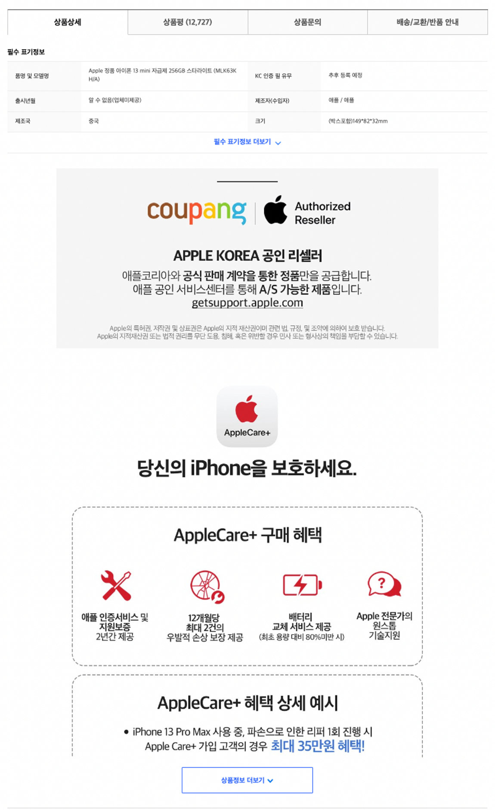
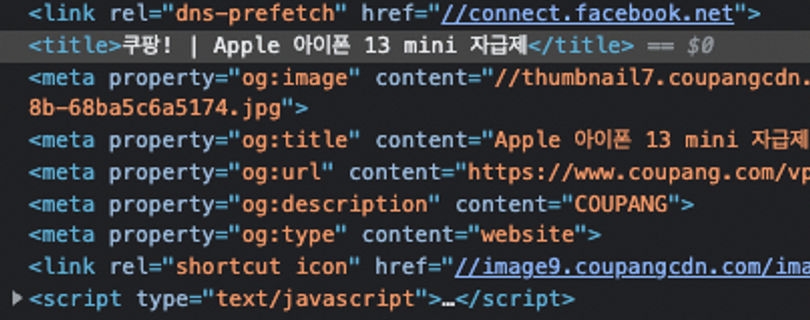

# NUMBLE - 가장 실무에 가까운 쿠팡 클론코딩 3회차

[배포 URL](https://dancing-biscotti-24688b.netlify.app/products/1?vendoritemId=1&itemId=1)

<details>
  <summary style='font-size:20px'>과제보기</summary>

  <div markdown="1">

  <br/>

## 미션 소개

- 이번 챌린지에서는 [쿠팡 상품 페이지](https://www.coupang.com/vp/products/6091199461?itemId=11356857104&vendorItemId=78633225471&pickType=COU_PICK&q=%EC%95%84%EC%9D%B4%ED%8F%B0+13+%EB%AF%B8%EB%8B%88&itemsCount=36&searchId=97f63d918f094f9aabfc14cdf601c09a&rank=0&isAddedCart=)를 구현해보겠습니다.

- (링크 주소: [https://www.coupang.com/vp/products/6091199461?itemId=11356857104&vendorItemId=78633225471](https://www.coupang.com/vp/products/6091199461?itemId=11356857104&vendorItemId=78633225471&pickType=COU_PICK&q=%EC%95%84%EC%9D%B4%ED%8F%B0+13+%EB%AF%B8%EB%8B%88&itemsCount=36&searchId=97f63d918f094f9aabfc14cdf601c09a&rank=0&isAddedCart=))

- 공통된 UI들을 컴포넌트로 추출하고 확장성을 고려하여 단단하계 설계해봅니다.

- 상태 관리 및 비즈니스 로직에 집중하여, 화면을 어느 단위로 나누는 것이 효율적일지 고민해봅니다

- 가독성 좋은 JSX 작성, 디렉토리 구조 등 프론트엔드에서의 Clean Code에 집중합니다.

- (‘상품 상세'외의 탭들은 구현하지 않습니다.)

- 데이터 연동을 위해 쿠팡과 동일한 형식의 API가 제공되지만, 적용하기 깔끔하진 않아 이번 챌린지에선 연동하지 않고 UI에 더미값을 넣어주셔도 괜찮습니다.

---

### 상품정보 영역


- 최상단에서 상품 구매에 필수적인 정보들을 보여주는 구역입니다.

- 시간 관계상 위의 사진에서 빨간색 박스로 표시된 부분은 구현하지 않으셔도 됩니다.

<br/>

### 다른 상품들 영역


- 시간 관계상 ‘다른 고객이 함께 구매한 상품'은 구현하지 않습니다.

<br/>

### 상품상세 영역



<br/>

### SEO



- next/head를 사용해 페이지의 정보들을 적절한 메타태그로 추가해보세요.

<br/>

### 주의사항

1. 공용 컴포넌트들은 포함되지 않아요.

  

- 이번 챌린지의 목표는 하나의 페이지를 데이터와 상태를 기준으로 나누어보는 것입니다.

- 최상단의 공용 컴포넌트들은 상품 페이지 내부와 무관하기 때문에 이번 챌린지에서는 다루지 않습니다!

2. 똑같이 구현하는 것 보다는 아래 주제들에 집중해주세요!

   - 기본 컴포넌트들이 적절히 정의되어 재사용되었는가

   - 컴포넌트가 나눠진 단위가 직관적으로 이해하기 쉬운가

   - prop을 통해 state가 간결하고 명확하게 전달되고 있는가

3. 개발 편의를 위해 너비/높이/폰트크기 등을 임의로 약간씩 조정하셔도 좋습니다.

---

## API 목록

= 4개의 엔드포인트가 존재합니다. 경로와 데이터 형식은 쿠팡과 동일합니다!

- productId, itemId, vendoritemId로 어떤 값을 넣어도 동일한 결과를 반환합니다.

1. 상품정보 영역 - breadcrumb

   - 경로: /api/products/[productId]/breadcrumb-gnbmenu

2. 상품정보 영역

   - 경로: /api/products/[productId]/vendoritems/[vendoritemId]

3. 다른 상품들 영역

   - 경로: /api/products/[productId]/brand-sdp/widget/brand-sdp?itemId=[itemId]&vendoritemId=[vendoritemId]

4. 상품상세 영역
   - 경로: /api/products/[productId]/items/[itemId]/vendoritems/[vendoritemId]

  </div>
</details>

---

<br/>

## 상품 페이지 구현

- BreadCrumb 같은 경우에는 제공되는 API가 적용하기에 깔끔하지 않은 부분이 있었기 때문에 api Routes를 통해서 필요한 데이터를 받아올 수 있도록 처리했습니다.

```js
// pages/api/products/[productId]/breadcrumb-gnbmenu.ts

import { NextApiRequest, NextApiResponse } from 'next';

export default function handler(req: NextApiRequest, res: NextApiResponse) {
  if (req.method === 'GET') {
    res
      .status(200)
      .json([
        '쿠팡 홈  >',
        '가전디지털  >',
        '1인방송 전문관  >',
        '카메라  >',
        '휴대폰',
      ]);
  }
}
```

<br/>

- react-query를 직접 사용하는 것이 아니라 API request를 위한 추상화된 모듈을 가져다 사용할 수 있도록 아래처럼 useRequest 정의해주는 방식으로 react-query의 useQuery를 격리해주었습니다.

```js
// src/hoooks/useRequest.ts

import { useQuery } from 'react-query';

type QueryOptions = {
  refetchInterval?: number,
  enabled?: boolean,
};

export const useRequest = (
  key: string | string[],
  request: () => Promise<any>,
  option?: QueryOptions
) => {
  return useQuery(key, request, { ...option });
};
```

<br/>

- 그리고 상품과 관련된 함수들을 가져다 사용할 수 있는 Product 클래스를 정의해서 모듈화시켜주었습니다.

```js
// src/services/product.service.ts

import axios from 'axios';
import Service from './service';

class Product extends Service {
  async getProductList(productId: string | undefined) {
    const { data } = await axios({
      url: `/api/products/${productId}/breadcrumb-gnbmenu`,
      method: 'get',
    });

    return data;
  }

  async getProductInfo(
    productId: string | undefined,
    vendoritemId: string | undefined
  ) {
    const { data } = await super.get(
      `/api/products/${productId}/vendoritems/${vendoritemId}`
    );

    return data;
  }

  async getOtherProduct(
    productId: string | undefined,
    itemId: string | undefined,
    vendoritemId: string | undefined
  ) {
    const { data } = await super.get(
      `/api/products/${productId}/brand-sdp/widget/brand-sdp?itemId=${itemId}&vendoritemId=${vendoritemId}`
    );

    return data;
  }

  async getProductDetails(
    productId: string | undefined,
    itemId: string | undefined,
    vendoritemId: string | undefined
  ) {
    const { data } = await super.get(
      `/api/products/${productId}/items/${itemId}/vendoritems/${vendoritemId}`
    );

    return data;
  }
}

export default new Product();
```

<br/>

- 위에서 정의한 Product class와 useRequest hook을 사용해서 필요한 상품 관련된 정보를 가져올 수 있는 query를 정의한 후 필요한 컴포넌트에서 사용할 수 있도록 했습니다.

```js
// src/quries/product.ts

import { useRequest } from './../hooks/useRequest';
import Product from '../services/product.service';

export const useGetProductBreadCrumb = (productId: string | undefined) => {
  return useRequest(
    [`product-breadcrumb-${productId}`],
    () => Product.getProductList(productId),
    {
      enabled: productId !== undefined,
    }
  );
};

export const useGetProductInfo = (
  productId: string | undefined,
  vendoritemId: string | undefined
) => {
  return useRequest(
    [`product-${productId}-${vendoritemId}`],
    () => Product.getProductInfo(productId, vendoritemId),
    {
      enabled: productId !== undefined && vendoritemId !== undefined,
    }
  );
};

export const useGetOtherProduct = (
  productId: string | undefined,
  itemId: string | undefined,
  vendoritemId: string | undefined
) => {
  return useRequest(
    [`product-other-${productId}${itemId}-${vendoritemId}`],
    () => Product.getOtherProduct(productId, itemId, vendoritemId),
    {
      enabled:
        productId !== undefined &&
        itemId !== undefined &&
        vendoritemId !== undefined,
    }
  );
};

export const useGetProductDetails = (
  productId: string | undefined,
  itemId: string | undefined,
  vendoritemId: string | undefined
) => {
  return useRequest(
    [`product-details-${productId}${itemId}-${vendoritemId}`],
    () => Product.getProductDetails(productId, itemId, vendoritemId),
    {
      enabled:
        productId !== undefined &&
        itemId !== undefined &&
        vendoritemId !== undefined,
    }
  );
};
```

---

<br/>

## SEO

- product 정보를 불러온 후, 해당 product 제품에 맞는 title을 보여주고 페이지에 해당하는 정보를 meta 태그에 추가해주었습니다.

```jsx
// src/components/HeadeMeta.tsx
import Head from 'next/head';
import { useGetProductInfo } from '../quries/product';
import { paramsType } from '../../types/params';

const HeadMeta = ({ productId, vendoritemId }: paramsType) => {
  const { data } = useGetProductInfo(productId, vendoritemId);

  return (
    <Head>
      <title>{`쿠팡 |  ${data ? data.itemName : ''}`}</title>
      <meta property='og:type' content='website' />
      <meta property='og:title' content={data?.itemName} />
      <meta property='og:description' content='쿠팡 상품 페이지' />
    </Head>
  );
};

export default HeadMeta;
```
